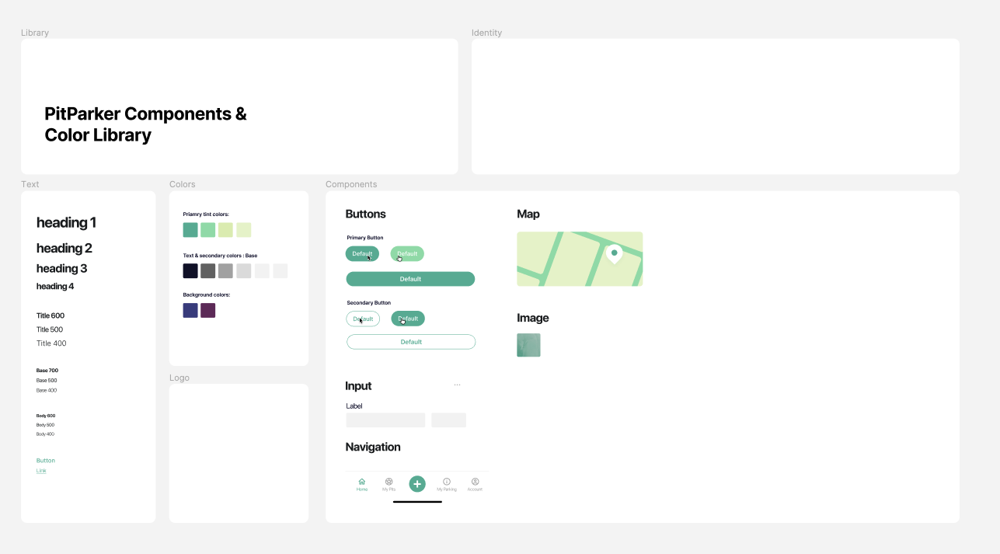
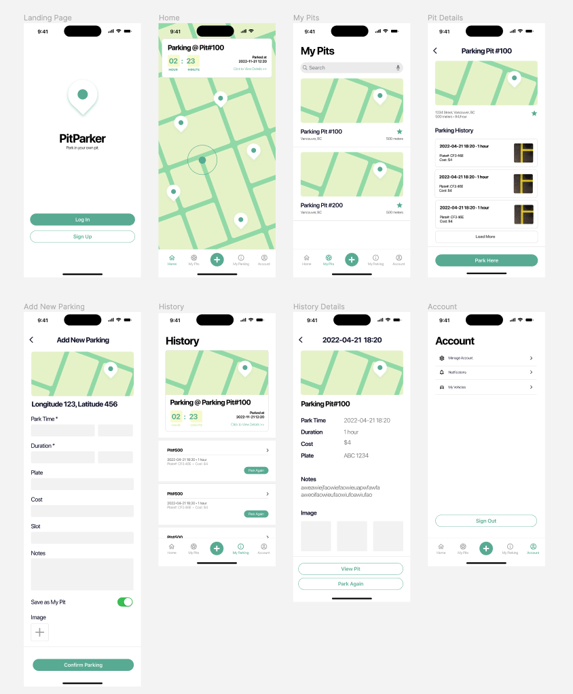

<!-- PROJECT LOGO -->

  <!--  -->

<h3 align="center">PitParker</h3>

  

    The PitParker app makes your parking easier. From helping with finding the optimal parking for you and allowing you to save your parking in seconds, and friendly reminding you of the extension without having to manually check.
     
    <a href="https://github.com/PitParkerTeam/MobileApp-PitParker">
        <strong>Explore the docs »</strong>
    </a>
     
     
    <!-- <a href="">View Live Demo</a> -->
    <!-- · -->
    <a href="https://github.com/PitParkerTeam/MobileApp-PitParker/issues">Report Bug</a>
    ·
    <a href="https://github.com/PitParkerTeam/MobileApp-PitParker/issues">Request Feature</a>
  

## Team

- Xinyi Ren - [@littlerzrz](https://github.com/littlerzrz) - ren.xiny@northeastern.edu
- Xiaoben Yin - [@XiaobenYin](https://github.com/XiaobenYin) - yin.xiaob@northeastern.edu
- Chenru Wu - [@wuchenru](https://github.com/wuchenru) - wu.chenru@northeastern.edu

## Design
[Figma](https://www.figma.com/file/bdToIyhr0VmqOBXjil023Y/PitParker-Mobile-Design?node-id=0%3A1&t=Zz1Viqm3hyRdWWrL-1)

<!-- ## Screens -->

<!-- LOGS -->

## Logs

### Iteration 1 - 2022/11/23
- Design of all screens
- Setup firebase & firestore
- Setup project basic structures and configurations
- Components basics
- Navigations setup
- Screens basics setup

### Iteration 2 - 2022/11/30
- Finished design for all major screens & components
    
    
- Created data structure for firebase and query
- Added authorization for login/signup
- Connected Map API for home screen/components/display
- Created components to share between screens
- Basics and foundamental logics for below screens done:
  - Home
  - My Pits
  - My Parking

#### Future Goals after iteration 2
- Notification
- Map configuration & customization
- Screens:
  - Account Settings
  - Add New Parking
- Styling
- Map Advanced
  - querying(? getting parking lot information from google, etc.)
  - getting names of different areas(?)
  - how to avoid duplicate pits & recognizations of same pits based on location details

## Testing
Test User with some data:
- email: abc@aaa.com
- password: abc123
<!-- MARKDOWN LINKS & IMAGES -->

[project-url]: https://github.com/PitParkerTeam/MobileApp-PitParker
