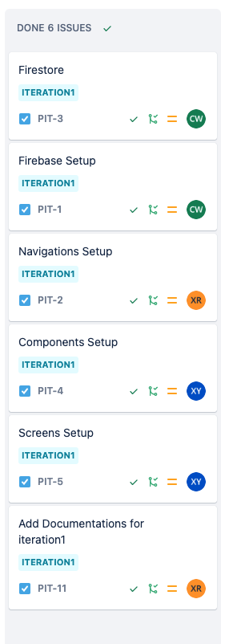

<!-- PROJECT LOGO -->

  <!--  -->

<h3 align="center">PitParker</h3>

  

    The PitParker app makes your parking easier.From helping with finding the optimal parking for you and allowing you to save your parking in seconds, and friendly reminding you of the extension without having to return to your vehicle.
     
    <a href="https://github.com/PitParkerTeam/MobileApp-PitParker">
        <strong>Explore the docs »</strong>
    </a>
     
     
    <!-- <a href="">View Live Demo</a> -->
    <!-- · -->
    <a href="https://github.com/PitParkerTeam/MobileApp-PitParker/issues">Report Bug</a>
    ·
    <a href="https://github.com/PitParkerTeam/MobileApp-PitParker/issues">Request Feature</a>
  

## Team

- Xinyi Ren - [@littlerzrz](https://github.com/littlerzrz) - ren.xiny@northeastern.edu
- Xiaoben Yin - [@XiaobenYin](https://github.com/XiaobenYin) - yin.xiaob@northeastern.edu
- Chenru Wu - [@wuchenru](https://github.com/wuchenru) - wu.chenru@northeastern.edu

<!-- LOGS -->

## Logs

### Iteration 1

- Setup firebase & firestore
  - branch `PIT-1-firebase-setup`
  - branch `PIT-3-firestore`
- Setup project basic structures and configurations
  - branch `main` & `dev`
- Components basics
  - branch `PIT-4-components`
- Navigations
  - branch `PIT-2-navigations`
- Screens
  - branch `PIT-5-screens`

<!-- MARKDOWN LINKS & IMAGES -->

[project-url]: https://github.com/PitParkerTeam/MobileApp-PitParker
