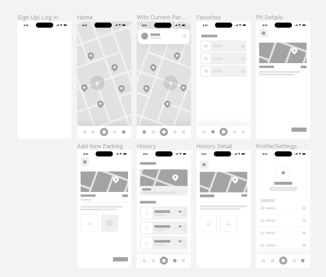

<!-- PROJECT LOGO -->

  <!--  -->

<h3 align="center">PitParker</h3>

  

    The PitParker app makes your parking easier. From helping with finding the optimal parking for you and allowing you to save your parking in seconds, and friendly reminding you of the extension without having to manually check.
     
    <a href="https://github.com/PitParkerTeam/MobileApp-PitParker">
        <strong>Explore the docs »</strong>
    </a>
     
     
    <!-- <a href="">View Live Demo</a> -->
    <!-- · -->
    <a href="https://github.com/PitParkerTeam/MobileApp-PitParker/issues">Report Bug</a>
    ·
    <a href="https://github.com/PitParkerTeam/MobileApp-PitParker/issues">Request Feature</a>
  

## Team

- Xinyi Ren - [@littlerzrz](https://github.com/littlerzrz) - ren.xiny@northeastern.edu
- Xiaoben Yin - [@XiaobenYin](https://github.com/XiaobenYin) - yin.xiaob@northeastern.edu
- Chenru Wu - [@wuchenru](https://github.com/wuchenru) - wu.chenru@northeastern.edu

## Demo
[Demo Video On YouTube](https://youtu.be/J8gz3yZgoUU)

## Design

[Figma](https://www.figma.com/file/bdToIyhr0VmqOBXjil023Y/PitParker-Mobile-Design?node-id=0%3A1&t=Zz1Viqm3hyRdWWrL-1)

<!-- ## Screens -->
## Screens

<!-- LOGS -->
## Logs

### Iteration 1 - 2022/11/23
- Basic Logic Design of all screens
- Setup firebase & firestore
- Setup project basic structures and configurations
- Components basics
- Navigations setup
- Screens basics setup

### Iteration 2 - 2022/11/30
- Finished UX/UI design for all major screens & components
- Created data structure for firebase and query
- Added authorization for login/signup
- Connected Map API for home screen/components/display
- Created components to share between screens
- Basics and foundamental logics for below screens done:
  - Home
  - My Pits
  - My Parking

#### Future Goals after iteration 2
- Notification
- Map configuration & customization
- Screens:
  - Account Settings
  - Add New Parking
- Styling
- Map Advanced
  - querying(? getting parking lot information from google, etc.)
  - getting names of different areas(?)
  - how to avoid duplicate pits & recognizations of same pits based on location details

### Iteration 3 - 2022/12/09
- Finished Map configuration & customization
- Added Backend services for Google Map Places API for nearby parking information
- Added markers for parking lots from Google Map
- Added auto imports from Google Map nearby parking lots to our database based on user location
- Integrated MobX as state management tool
- Added account page
- Added Image function

### Iteration 4 - 2022/12/12
- Finished all basics and logics of the app
- Created feature for user customized notifications
- Added reminder function for parking expiring
- Added feature for password changing
- Allowed users to get directions directly from our app

<!-- MARKDOWN LINKS & IMAGES -->

[project-url]: https://github.com/PitParkerTeam/MobileApp-PitParker
